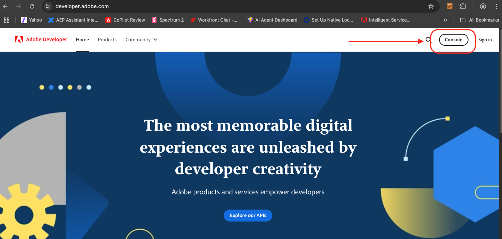
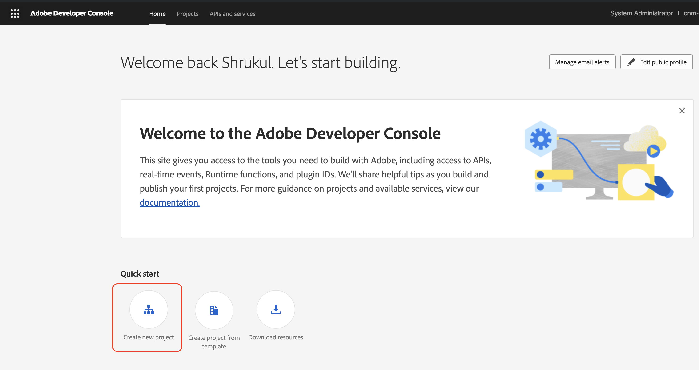
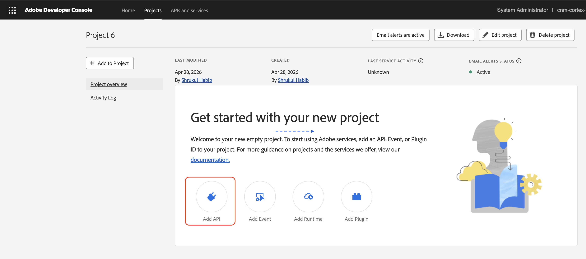
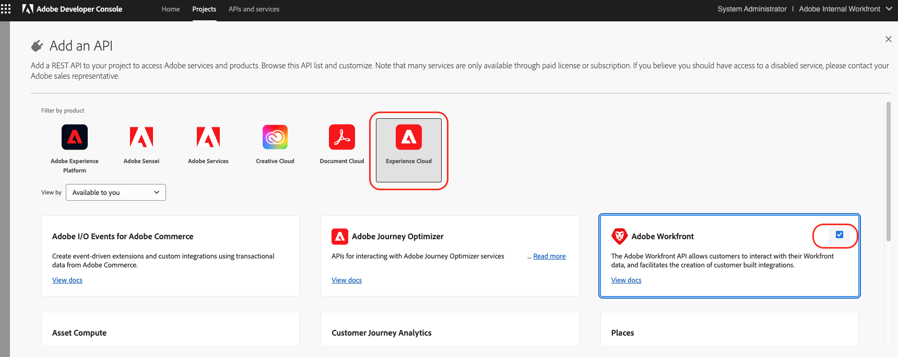
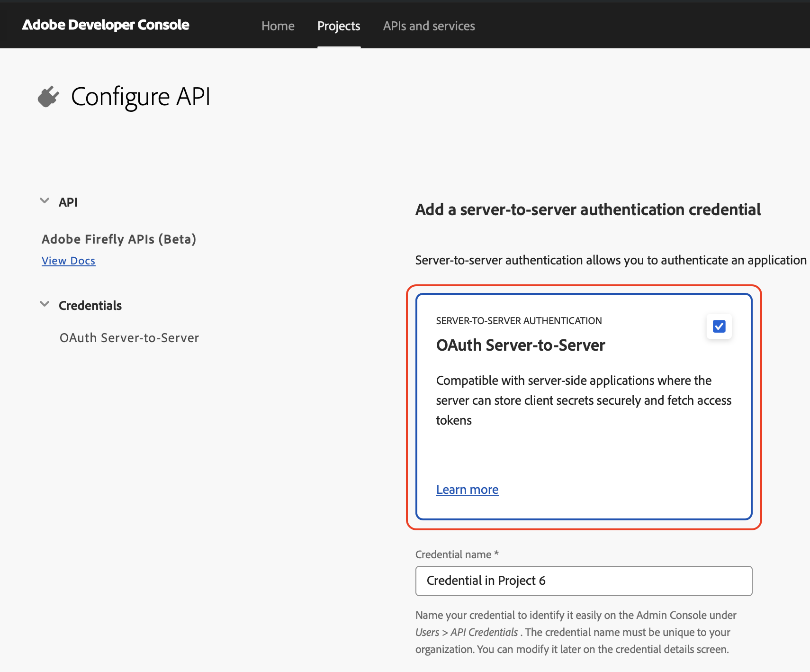
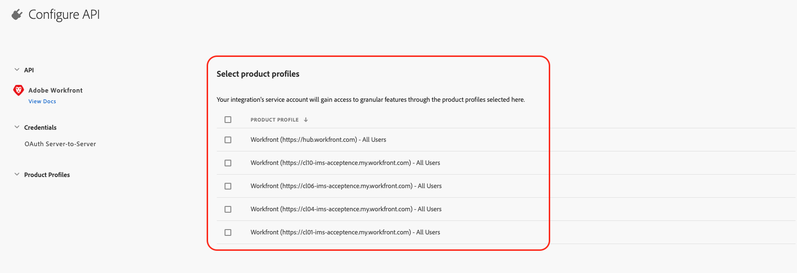
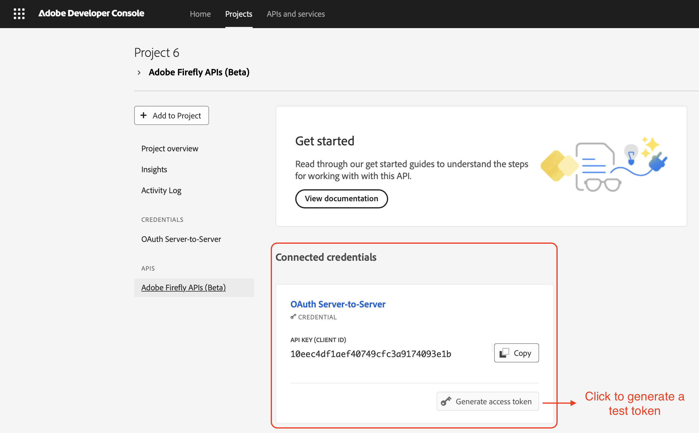
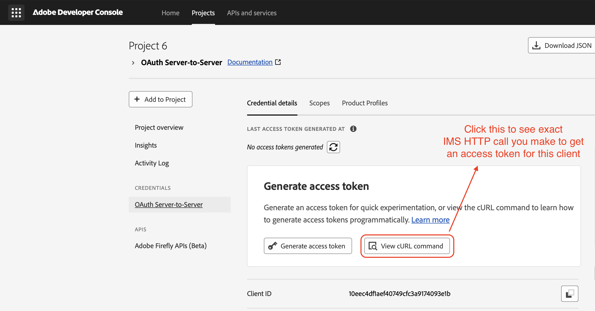

# Authentication

This guide walks you through setting up OAuth Server-to-Server credentials in Adobe Developer Console and generating an access token. At the end you will have an `ACCESS_TOKEN` ready to authenticate all Brand Intelligence API requests.

<InlineAlert variant="info" slots="text"/>

Before making API calls, your organisation's **brand profile** must be configured as part of your Adobe Brand Intelligence onboarding. Contact your Adobe representative if this has not been completed.

## Prerequisites

- An organisation with access to Adobe Brand Intelligence.
- An Admin Console administrator who can add you as a developer on a product profile.

## Gain developer access

Before creating integrations on Adobe Developer Console, your account must have developer access in Adobe Admin Console.

See the Admin Console documentation for specific instructions on how to [manage developer access for product profiles](https://helpx.adobe.com/enterprise/using/manage-developers.html).

Once assigned as a developer, you can create integrations in [Adobe Developer Console](https://developer.adobe.com). These integrations connect external apps and services to Adobe APIs.

## Set up API credentials

The following steps walk you through setting up OAuth Server-to-Server credentials for Brand Intelligence.

### Step 1: Access Developer Console

API setup is done through [Adobe Developer Console](https://developer.adobe.com).



### Step 2: Create a project

After logging in, create a new Project. Projects group related integrations and API clients.



After creating a project, select **Add API**.



Adobe Brand Intelligence APIs are listed under the **Adobe Firefly Services** category as **Adobe Brand Intelligence**.



### Step 3: Configure OAuth Server-to-Server credentials

Select the **OAuth Server-to-Server** credential type. Give your credential a meaningful name and select **Next**.



If your IMS Org has multiple instances, select the instance you want this API client associated with.



Your new credential is now listed in the project.



Select the credential to view its details, including your **Client ID** and **Client Secret**.



## Generate an access token

With your credentials in hand, request a token from Adobe IMS:

```bash
export CLIENT_ID=<your_client_id>
export CLIENT_SECRET=<your_client_secret>

curl --location 'https://ims-na1.adobelogin.com/ims/token/v3' \
  --header 'Content-Type: application/x-www-form-urlencoded' \
  --data-urlencode 'grant_type=client_credentials' \
  --data-urlencode "client_id=$CLIENT_ID" \
  --data-urlencode "client_secret=$CLIENT_SECRET" \
  --data-urlencode 'scope=openid,AdobeID'
```

**Example response:**

```json
{
  "access_token": "eyJhbGciOiJSUzI1NiIsIng1dSI6...",
  "token_type": "bearer",
  "expires_in": 86399
}
```

Export the token for use in subsequent requests:

```bash
export ACCESS_TOKEN=<access_token_from_response>
```

Tokens are valid for 24 hours (`expires_in: 86399` seconds). Implement a refresh mechanism to request a new token before the current one expires.

## Make authenticated requests

Include the token in every Brand Intelligence API request:

```bash
--header "Authorization: Bearer $ACCESS_TOKEN"
```

Brand Intelligence resolves your tenant and permissions from the token. There is no separate API key.

<InlineAlert variant="warning" slots="text"/>

Never commit or log your Client ID, Client Secret, or access tokens. Store credentials securely server-side and keep them out of version control.
