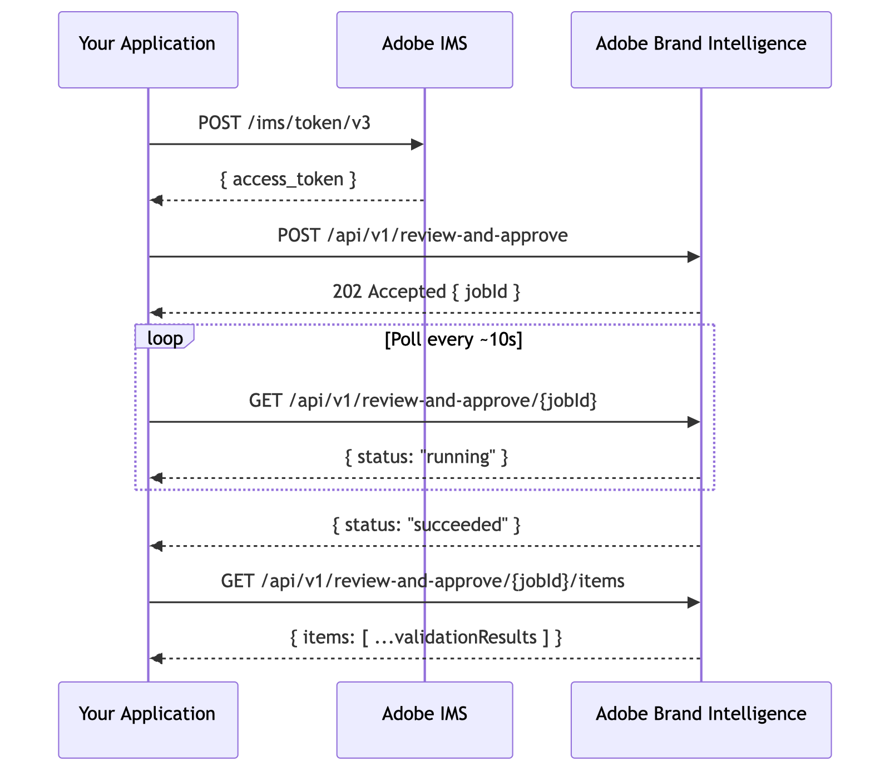

# Quickstart

This guide walks you through the complete validation flow - from getting an access token to reading per-asset results - using `curl`.

## Prerequisites

- Your organization's **brand profile** is configured. This is set up during Adobe Brand Intelligence onboarding — contact your Adobe representative if this has not been completed.
- OAuth Server-to-Server credentials set up in Adobe Developer Console (see [Authentication](../authentication/index.md)).
- Your **Client ID** and **Client Secret** available in a secure terminal session.
- One or more asset URLs accessible from Adobe's servers (publicly reachable or pre-signed).


## Validation flow

The Brand Intelligence API is asynchronous. You submit a job, receive a `jobId`, poll until the job completes, then fetch per-asset results.




## Step 1 - Get an access token

Export your credentials as environment variables:

```bash
export CLIENT_ID=<your_client_id>
export CLIENT_SECRET=<your_client_secret>
```

Request a token from Adobe IMS:

```bash
curl --location 'https://ims-na1.adobelogin.com/ims/token/v3' \
  --header 'Content-Type: application/x-www-form-urlencoded' \
  --data-urlencode 'grant_type=client_credentials' \
  --data-urlencode "client_id=$CLIENT_ID" \
  --data-urlencode "client_secret=$CLIENT_SECRET" \
  --data-urlencode 'scope=openid,AdobeID'
```

Export the token for use in subsequent requests:

```bash
export ACCESS_TOKEN=<access_token_from_response>
```

Tokens are valid for 24 hours (`expires_in: 86399`). Refresh before expiry to avoid interruption.


## Step 2 - Submit a validation job

Submit one or more assets for brand validation. Each asset requires a `nodeId` (your identifier for the asset) and a `url` (where ABI can download it).

```bash
curl --request POST \
  --url 'https://abi.adobe.io/api/v1/review-and-approve' \
  --header "Authorization: Bearer $ACCESS_TOKEN" \
  --header 'Content-Type: application/json' \
  --data '{
    "batchName": "Spring Campaign - Banner Set",
    "campaignId": "<your_campaign_id>",
    "assets": [
      {
        "clientItemId": "banner-01",
        "asset": { "mediaType": "image/png", "value": "<asset_url_1>" }
      },
      {
        "clientItemId": "banner-02",
        "asset": { "mediaType": "image/png", "value": "<asset_url_2>" }
      }
    ]
  }'
```

**Response** (`202 Accepted`):

```json
{
  "jobId": "9b9d00c5-8659-4766-8430-ed0a1c9bd87d",
  "statusUrl": "https://abi.adobe.io/api/v1/review-and-approve/9b9d00c5-8659-4766-8430-ed0a1c9bd87d",
  "submittedCount": 2,
  "acceptedCount": 2,
  "rejectedCount": 0
}
```

Save the `jobId`:

```bash
export JOB_ID=9b9d00c5-8659-4766-8430-ed0a1c9bd87d
```

<InlineAlert variant="info" slots="text"/>

`campaignId` is optional. Omit it to validate against organization-level brand guidelines only. Include it to also apply campaign-specific rules.


## Step 3 - Poll job status

Call the status endpoint every 5–10 seconds until the job reaches a terminal state.

```bash
curl --request GET \
  --url "https://abi.adobe.io/api/v1/review-and-approve/$JOB_ID" \
  --header "Authorization: Bearer $ACCESS_TOKEN"
```

**Response while running** (`200 OK`):

```json
{
  "jobId": "9b9d00c5-8659-4766-8430-ed0a1c9bd87d",
  "status": "running",
  "succeededCount": 1,
  "failedCount": 0,
  "pendingCount": 1
}
```

Keep polling until `status` is one of: `succeeded`, `partially_succeeded`, `failed`, or `canceled`.


## Step 4 - Fetch per-asset results

Once the job completes, retrieve validation results for each asset.

```bash
curl --request GET \
  --url "https://abi.adobe.io/api/v1/review-and-approve/$JOB_ID/items" \
  --header "Authorization: Bearer $ACCESS_TOKEN"
```

**Response** (`200 OK`):

```json
{
  "jobId": "9b9d00c5-8659-4766-8430-ed0a1c9bd87d",
  "items": [
    {
      "clientItemId": "banner-01",
      "status": "SUCCEEDED",
      "validationSummary": { "summaryText": "The asset meets all brand guidelines." },
      "validationErrors": []
    },
    {
      "clientItemId": "banner-02",
      "status": "SUCCEEDED",
      "validationSummary": { "summaryText": "The asset violates 1 brand guideline." },
      "validationErrors": [
        {
          "errorId": "e1a2b3c4-0000-0000-0000-000000000001",
          "errorSummary": "Color #FF0000 is not in the approved palette."
        }
      ]
    }
  ]
}
```

Assets with an empty `validationErrors` array are fully compliant. Assets with entries require attention before publication.


## What's next

- Explore all available endpoints in the [API Reference](../../api/index.md).
- Learn about [Comments](../core-concepts/index.md) to attach reviewer feedback to flagged assets.
- Try the API interactively with [Postman](../using-postman/index.md).
