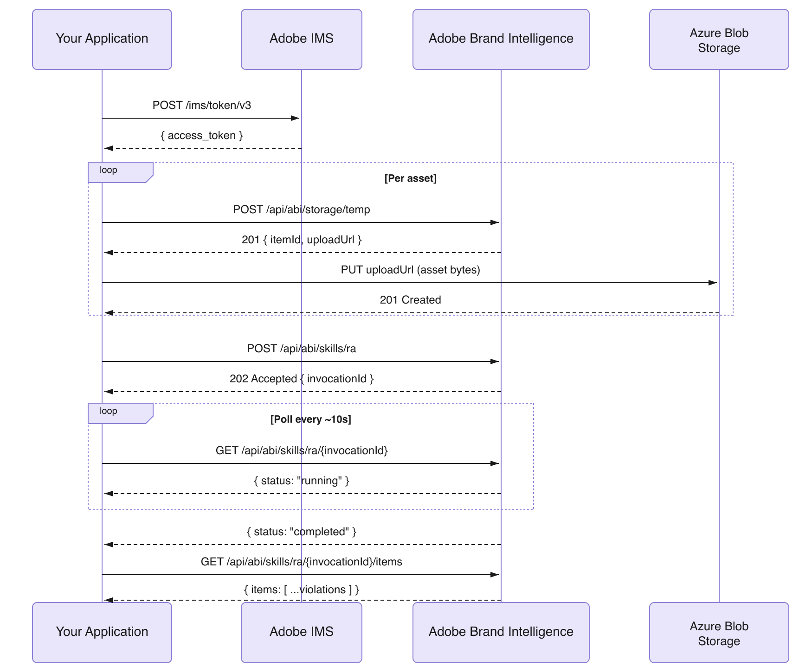

# Quickstart

This guide walks you through the complete validation flow - from getting an access token to reading per-asset results - using `curl`.

## Prerequisites

- Your organization's **brand profile** is configured. This is set up during Adobe Brand Intelligence onboarding - contact your Adobe representative if this has not been completed.
- OAuth Server-to-Server credentials set up in Adobe Developer Console (see [Authentication](../authentication/index.md)).
- Your **Client ID** and **Client Secret** available in a secure terminal session.
- One or more asset files ready to upload, or asset URLs already reachable on the public web.


## Validation flow

The Brand Intelligence API is asynchronous. You submit an invocation, receive an `invocationId`, poll until the invocation completes, then fetch per-asset results.




## Step 1 - Get an access token

Export your credentials as environment variables:

```bash
export CLIENT_ID=<your_client_id>
export CLIENT_SECRET=<your_client_secret>
```

Request a token from Adobe IMS:

```bash
curl --location 'https://ims-na1.adobelogin.com/ims/token/v3' \
  --header 'Content-Type: application/x-www-form-urlencoded' \
  --data-urlencode 'grant_type=client_credentials' \
  --data-urlencode "client_id=$CLIENT_ID" \
  --data-urlencode "client_secret=$CLIENT_SECRET" \
  --data-urlencode 'scope=openid,AdobeID'
```

Export the token for use in subsequent requests:

```bash
export ACCESS_TOKEN=<access_token_from_response>
```

Tokens are valid for 24 hours (`expires_in: 86399`). Refresh before expiry to avoid interruption.


## Step 2 - Upload your assets

ABI validates assets that live in its own storage - you upload each asset first and reference it by the returned `itemId` when you submit the invocation.

For each asset, request an upload slot:

```bash
curl --request POST \
  --url 'https://abi-mw.adobe.io/api/abi/storage/temp' \
  --header "Authorization: Bearer $ACCESS_TOKEN" \
  --header 'Content-Type: application/json' \
  --data '{ "tenantId": "<your_tenant_id>" }'
```

**Response** (`201 Created`):

```json
{
  "itemId": "c3f1a2b0-0000-0000-0000-000000000001",
  "uploadUrl": "https://<storage-account>.blob.core.windows.net/<container>/<blob>?<sas-token>",
  "uploadUrlExpiresAt": "2026-08-31T13:00:00Z"
}
```

Save the `itemId`, then `PUT` the asset bytes directly to `uploadUrl` - it's an Azure Blob SAS URL, so the upload needs the `x-ms-blob-type` header:

```bash
curl --request PUT \
  --upload-file banner-01.png \
  --header "x-ms-blob-type: BlockBlob" \
  --url "<uploadUrl_from_response>"
```

`uploadUrl` expires one hour after it's issued - upload promptly. Repeat this step once per asset. Save each `itemId`:

```bash
export ITEM_ID_1=c3f1a2b0-0000-0000-0000-000000000001
export ITEM_ID_2=c3f1a2b0-0000-0000-0000-000000000002
```

<InlineAlert variant="info" slots="text"/>

Assets already reachable on the public web don't need this step - set `itemSource: "web"` and `sourceRef: "<asset_url>"` directly in Step 3 instead of uploading.


## Step 3 - Submit a validation invocation

Submit one or more uploaded assets for brand validation. Each item requires an `itemSource`, a `sourceRef`, a `mediaType`, and an `itemName`. For uploaded assets, `itemSource` is `blob` and `sourceRef` is the `itemId` from Step 2.

```bash
curl --request POST \
  --url 'https://abi-mw.adobe.io/api/abi/skills/ra' \
  --header "Authorization: Bearer $ACCESS_TOKEN" \
  --header 'Content-Type: application/json' \
  --data '{
    "tenantId": "<your_tenant_id>",
    "campaignId": "<your_campaign_id>",
    "displayName": "Spring Campaign - Banner Set",
    "items": [
      {
        "itemSource": "blob",
        "sourceRef": "'"$ITEM_ID_1"'",
        "mediaType": "image/png",
        "itemName": "banner-01"
      },
      {
        "itemSource": "blob",
        "sourceRef": "'"$ITEM_ID_2"'",
        "mediaType": "image/png",
        "itemName": "banner-02"
      }
    ]
  }'
```

**Response** (`202 Accepted`):

```json
{
  "invocationId": "9b9d00c5-8659-4766-8430-ed0a1c9bd87d",
  "skill": "ra",
  "tenantId": "<your_tenant_id>",
  "campaignId": "<your_campaign_id>",
  "status": "queued",
  "itemCount": 2,
  "successCount": 0,
  "failureCount": 0
}
```

Save the `invocationId`:

```bash
export INVOCATION_ID=9b9d00c5-8659-4766-8430-ed0a1c9bd87d
```

<InlineAlert variant="info" slots="text"/>

`campaignId` is optional. Omit it to validate against organization-level brand guidelines only. Include it to also apply campaign-specific rules.


## Step 4 - Poll invocation status

Call the status endpoint every 5–10 seconds until the invocation reaches a terminal state.

```bash
curl --request GET \
  --url "https://abi-mw.adobe.io/api/abi/skills/ra/$INVOCATION_ID" \
  --header "Authorization: Bearer $ACCESS_TOKEN"
```

**Response while running** (`200 OK`):

```json
{
  "invocationId": "9b9d00c5-8659-4766-8430-ed0a1c9bd87d",
  "skill": "ra",
  "tenantId": "<your_tenant_id>",
  "campaignId": "<your_campaign_id>",
  "status": "running",
  "itemCount": 2,
  "successCount": 1,
  "failureCount": 0
}
```

Keep polling until `status` is one of: `completed`, `failed`, or `cancelled`. Under `completed`, check `successCount` / `failureCount` - some items may still have failed even though the invocation as a whole finished.


## Step 5 - Fetch per-asset results

Once the invocation completes, list its items for a summary view.

```bash
curl --request GET \
  --url "https://abi-mw.adobe.io/api/abi/skills/ra/$INVOCATION_ID/items" \
  --header "Authorization: Bearer $ACCESS_TOKEN"
```

**Response** (`200 OK`):

```json
{
  "itemsCount": 2,
  "itemsWithViolations": 1,
  "itemsWithoutViolations": 1,
  "itemsFailed": 0,
  "items": [
    {
      "itemId": "a1b2c3d4-0000-0000-0000-000000000001",
      "status": "completed",
      "mediaType": "image/png",
      "itemName": "banner-01",
      "thumbnailUrl": "https://example.com/signed/banner-01-thumb.png",
      "violationCount": 0
    },
    {
      "itemId": "a1b2c3d4-0000-0000-0000-000000000002",
      "status": "completed",
      "mediaType": "image/png",
      "itemName": "banner-02",
      "thumbnailUrl": "https://example.com/signed/banner-02-thumb.png",
      "violationCount": 1
    }
  ]
}
```

Items with `violationCount: 0` are fully compliant. For items with violations, fetch the full detail to see what was flagged:

```bash
curl --request GET \
  --url "https://abi-mw.adobe.io/api/abi/skills/ra/$INVOCATION_ID/items/a1b2c3d4-0000-0000-0000-000000000002" \
  --header "Authorization: Bearer $ACCESS_TOKEN"
```

**Response** (`200 OK`):

```json
{
  "itemId": "a1b2c3d4-0000-0000-0000-000000000002",
  "status": "completed",
  "mediaType": "image/png",
  "itemName": "banner-02",
  "thumbnailUrl": "https://example.com/signed/banner-02-thumb.png",
  "renditionUrl": "https://example.com/signed/banner-02.png",
  "result": {
    "summaryText": "The asset violates 1 brand guideline.",
    "violations": [
      {
        "violationId": "v-0001",
        "violationSource": "system",
        "violationSummary": "Color #FF0000 is not in the approved palette.",
        "assetAttributions": [
          {
            "attributionId": "aa-0001",
            "documentId": "banner-02.png",
            "metadata": {},
            "regions": [
              {
                "regionType": "boundingBox",
                "boundingBox": { "x": 0.1, "y": 0.05, "width": 0.3, "height": 0.15 }
              }
            ]
          }
        ],
        "corpusAttributions": [
          {
            "attributionId": "ca-0001",
            "documentId": "brand-guidelines-color.pdf",
            "documentUrl": "https://example.com/signed/brand-guidelines-color.pdf",
            "chunkUrl": "https://example.com/signed/brand-guidelines-color-p4.pdf",
            "metadata": { "page": 4 },
            "regions": []
          }
        ],
        "recordVersion": 1
      }
    ]
  }
}
```

The response includes additional fields per item and per violation - see the [API Reference](../../api/index.md) for the full schema.


## What's next

- Explore all available endpoints in the [API Reference](../../api/index.md).
- Learn how to [attach reviewer feedback](../review-feedback/index.md) to flagged assets.
- Try the API interactively with [Postman](../using-postman/index.md).
